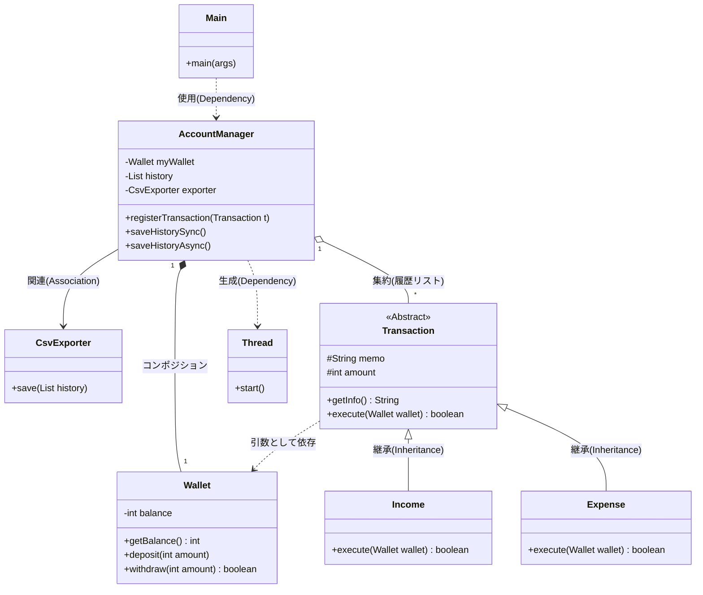

```mermaid
classDiagram
    %% --- クラス定義 ---
    
    class Main {
        +main(args)
    }

    class AccountManager {
        -Wallet myWallet
        -List<Transaction> history
        -CsvExporter exporter
        +registerTransaction(Transaction t)
        +saveHistorySync()
        +saveHistoryAsync()
    }

    class Wallet {
        -int balance
        +getBalance() int
        +deposit(int amount)
        +withdraw(int amount) boolean
    }

    class CsvExporter {
        +save(List<Transaction> history)
    }

    class Transaction {
        <<Abstract>>
        #String memo
        #int amount
        +getInfo() String
        +execute(Wallet wallet) boolean
    }

    class Income {
        +execute(Wallet wallet) boolean
    }

    class Expense {
        +execute(Wallet wallet) boolean
    }

    %% 標準ライブラリのThread（非同期の表現用）
    class Thread {
        +start()
    }

    %% --- 関係性の定義 ---

    %% 1. メインはマネージャーを使う
    Main ..> AccountManager : 使用(Dependency)

    %% 2. マネージャーは財布と履歴、エクスポーターを持つ
    AccountManager "1" *-- "1" Wallet : コンポジション
    AccountManager "1" o-- "*" Transaction : 集約(履歴リスト)
    AccountManager --> CsvExporter : 関連(Association)

    %% 3. 非同期処理でThreadを生成する
    AccountManager ..> Thread : 生成(Dependency)

    %% 4. 取引の親子関係
    Transaction <|-- Income : 継承(Inheritance)
    Transaction <|-- Expense : 継承(Inheritance)

    %% 5. 取引は実行時に財布を操作する
    Transaction ..> Wallet : 引数として依存
```