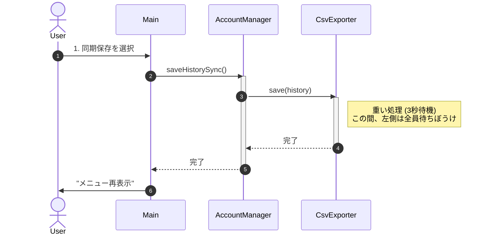

```mermaid
sequenceDiagram
    autonumber
    actor User
    participant Main
    participant Manager as AccountManager
    participant Exporter as CsvExporter

    User->>Main: 1. 同期保存を選択
    Main->>Manager: saveHistorySync()
    activate Manager
    
    Manager->>Exporter: save(history)
    activate Exporter
    
    Note right of Exporter: 重い処理 (3秒待機)<br>この間、左側は全員待ちぼうけ
    Exporter-->>Manager: 完了
    deactivate Exporter

    Manager-->>Main: 完了
    deactivate Manager
    
    Main->>User: "メニュー再表示"
```